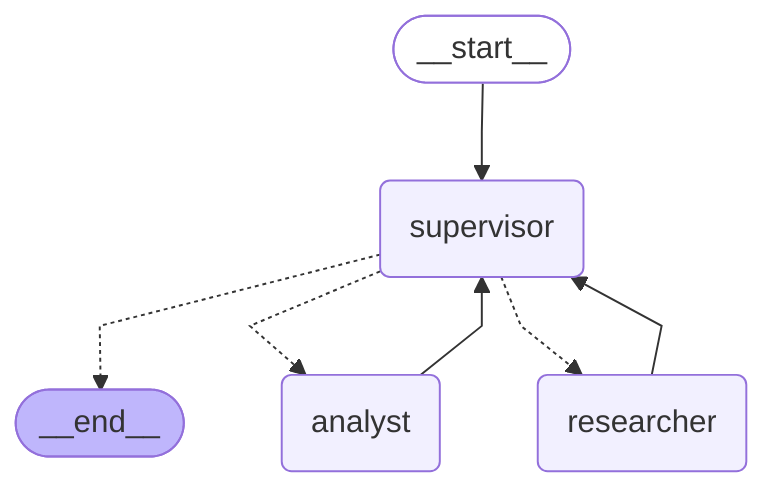

# Orquestador Multi-Agente de Análisis e Investigación

Prototipo funcional de un orquestador jerárquico con **LangGraph**: un nodo
**Supervisor** enruta dinámicamente el trabajo entre dos agentes especialistas
(**Investigación** y **Análisis**) hasta que la tarea se considera completa.
El caso de uso demo consulta y analiza el feedback histórico de las
pre-entregas anteriores del curso (base de datos simulada, ver
`data/pre_entregas_kb.json`).

## Arquitectura



*(Diagrama generado con `app.get_graph().draw_mermaid()`, ver `graph.py`. Se
puede regenerar corriendo `python -c "from graph import app; print(app.get_graph().draw_mermaid())"`.)*

### ¿Por qué topología jerárquica (Supervisor) y no un grafo peer-to-peer?

- **Una sola fuente de verdad sobre el flujo**: los especialistas nunca se
  comunican entre sí ni deciden "quién sigue". Eso queda 100% centralizado en
  `agents/supervisor.py`, lo que hace el enrutamiento fácil de auditar y de
  testear de forma aislada (ver `tests/test_supervisor_logic.py`).
- **Punto único de validación**: como el Supervisor es el único que decide
  `FINISH`, es también el único lugar donde hace falta aplicar la rúbrica de
  suficiencia y las salvaguardas anti-bucle. Con topología peer-to-peer esa
  lógica quedaría duplicada o dispersa entre agentes.
- **Escala mejor a más especialistas**: agregar un tercer agente (por ejemplo,
  un validador de compliance) es agregar un nodo más y una rama más en el
  `route_from_supervisor`, sin tocar a los especialistas existentes.

## Estado compartido (`state.py`)

`OrchestratorState` extiende `MessagesState` de LangGraph con:

| Campo | Uso |
|---|---|
| `user_query` | Consulta original. Se guarda aparte de `messages` para pasarle a cada especialista **solo esto**, no todo el historial (ver "Contaminación de contexto" abajo). |
| `next_agent` | `Literal["researcher", "analyst", "FINISH"]` — decisión del Supervisor, usada en la arista condicional. |
| `research_data` / `analysis_data` | Resultado concreto de cada especialista (separado del log conversacional). |
| `contributions` | Traza `{agent, summary, step}` de quién aportó qué. Usa el reducer `operator.add` para acumularse en cada paso sin perder aportes anteriores. |
| `steps` / `refinements_used` | Contadores que alimentan las salvaguardas anti-bucle del Supervisor. |
| `task_completed` | Flag final. |

## Agentes especialistas

- **`agents/research_agent.py`** — Agente de Investigación. Construido con
  `create_react_agent` + la tool `buscar_pre_entregas` (búsqueda simulada por
  keywords sobre `data/pre_entregas_kb.json`, simulando un retriever de base
  vectorial). Si se define `TAVILY_API_KEY`, se agrega además búsqueda web
  real con Tavily (`tools/search_tools.py`).
- **`agents/analyst_agent.py`** — Agente de Análisis. Construido con
  `create_react_agent` + tres tools de `tools/analysis_tools.py`:
  `calcular_promedio` (estadística sobre las calificaciones encontradas),
  `analizar_sentimiento` (léxico positivo/negativo en español) y
  `validar_datos` (validación de esquema mínimo: calificación + comentario).
- **`agents/supervisor.py`** — Router. Ver siguiente sección.

## Flujo de supervisión y control de conflictos

El Supervisor combina dos cosas que están **deliberadamente separadas** en el
código:

1. **`is_analysis_sufficient` + `decide_next_agent`** (funciones puras, sin
   LLM): la rúbrica dura. `decide_next_agent` es la única responsable de decir
   qué nodo sigue, y nunca deja pasar más de `MAX_STEPS` pasos de
   especialistas ni más de `MAX_REFINEMENTS` vueltas de refinamiento al
   Analista — **sin importar lo que responda el LLM**.
2. **`supervisor_node`** (usa LLM con salida estructurada `SupervisorReview`):
   solo aporta el juicio cualitativo ("¿este análisis está bien redactado y es
   consistente con los datos crudos, o hay que refinarlo?"). Ese juicio
   (`quiere_refinar`) se combina con la rúbrica dura, nunca la reemplaza.

Esta separación es la respuesta directa al error común del **"Supervisor
Infinito"**: aunque el LLM alucine o insista en pedir refinamientos, las
reglas duras (`steps >= MAX_STEPS`, `refinements_used >= MAX_REFINEMENTS`)
garantizan terminación. Está cubierto por tests que no requieren API key
(`tests/test_supervisor_logic.py::test_es_terminacion_garantizada_en_como_mucho_max_steps_mas_refinamientos`).

### Conflictos entre agentes (¿qué pasa si Investigación y Análisis "no coinciden"?)

El Investigador nunca interpreta datos y el Analista nunca vuelve a buscar
información: cada uno tiene tools acotadas a su rol, así que no hay forma de
que pisen el trabajo del otro. El único árbitro de calidad es el Supervisor,
que recibe **ambos** resultados (`research_data` y `analysis_data`) y valida
que el análisis no sea vago ni contradiga los datos crudos (parte de la
rúbrica en `SUPERVISOR_RUBRIC`, `agents/supervisor.py`). Si el análisis no
cumple, se le devuelve al Analista con una nota explícita de qué faltó — nunca
se le pide al Investigador que "reescriba" el análisis.

### Contaminación de contexto

Cada especialista se invoca con un `HumanMessage` **nuevo**, conteniendo solo
la instrucción específica que necesita (`state["user_query"]` para el
Investigador, `state["research_data"]` para el Analista) — nunca
`state["messages"]` completo, que incluye turnos del Supervisor y del otro
especialista. El historial completo se sigue acumulando en `messages` (vía
`add_messages`) solo para trazabilidad/auditoría humana, no para alimentar a
los agentes.

## Instalación

```powershell
python -m venv .venv
.venv\Scripts\Activate.ps1
pip install -r requirements.txt
copy .env.example .env
# Editar .env y completar GOOGLE_API_KEY (gratis: https://aistudio.google.com/app/apikey)
```

## Uso

```powershell
python main.py "¿Qué feedback recibió la Pre-entrega 2 y cuál es el sentimiento general?"
```

Sin argumentos, corre una consulta de demo que fuerza el flujo completo
Investigador → Analista → (posible refinamiento) → FINISH.

También hay un notebook de demo (`demo.ipynb`) que muestra: la estructura del
grafo, la lógica anti-bucle sin necesitar API key, y una ejecución real
paso a paso (`.stream()`) del flujo de delegación.

## Tests (no requieren API key)

```powershell
pip install pytest
python -m pytest tests/ -v
```

Cubren:
- `tests/test_supervisor_logic.py`: la rúbrica de suficiencia y la garantía de
  terminación del Supervisor (incluye una simulación adversarial donde el LLM
  "insiste" en refinar indefinidamente).
- `tests/test_tools.py`: las tools de búsqueda y análisis.

## Errores comunes evitados (checklist)

- ✅ **Supervisor Infinito**: `decide_next_agent` es una función pura, testeada
  de forma aislada, con `MAX_STEPS` y `MAX_REFINEMENTS` como topes duros.
- ✅ **Contaminación de contexto**: los especialistas reciben solo la
  instrucción/datos que necesitan, no el historial completo del sistema.
- ✅ **Validación antes del END**: el Supervisor no finaliza solo porque el
  Analista respondió algo — chequea la rúbrica (promedio + sentimiento
  explícitos) antes de aceptar el resultado.

## Estructura del repositorio

```
Pre_Entrega6/
├── state.py                 # Esquema del estado compartido
├── config.py                 # Selección de proveedor de LLM (Gemini por defecto)
├── graph.py                  # Construcción del StateGraph y aristas condicionales
├── main.py                   # CLI de entrada
├── demo.ipynb                 # Notebook de demo del flujo de delegación
├── agents/
│   ├── supervisor.py          # Router + rúbrica + salvaguardas anti-bucle
│   ├── research_agent.py      # Agente de Investigación (create_react_agent)
│   └── analyst_agent.py       # Agente de Análisis (create_react_agent)
├── tools/
│   ├── search_tools.py        # buscar_pre_entregas (+ Tavily opcional)
│   └── analysis_tools.py      # calcular_promedio, analizar_sentimiento, validar_datos
├── data/
│   └── pre_entregas_kb.json   # Base simulada de feedback de pre-entregas
├── tests/
│   ├── test_supervisor_logic.py
│   └── test_tools.py
├── requirements.txt
├── .env.example
└── .gitignore
```
